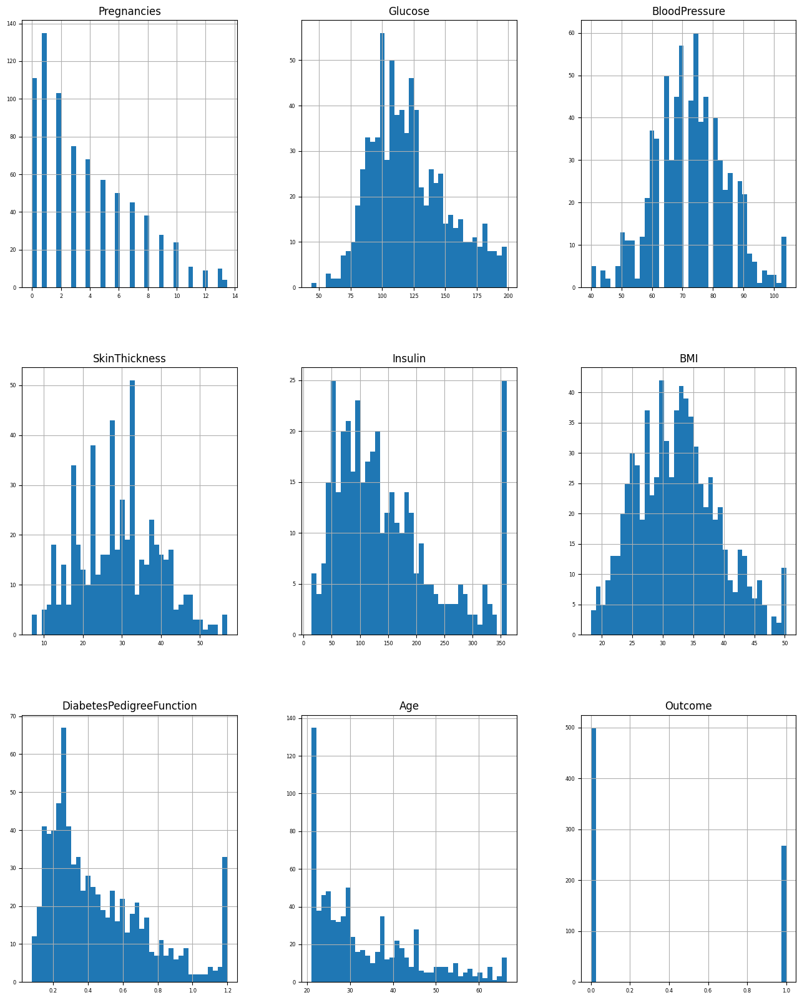
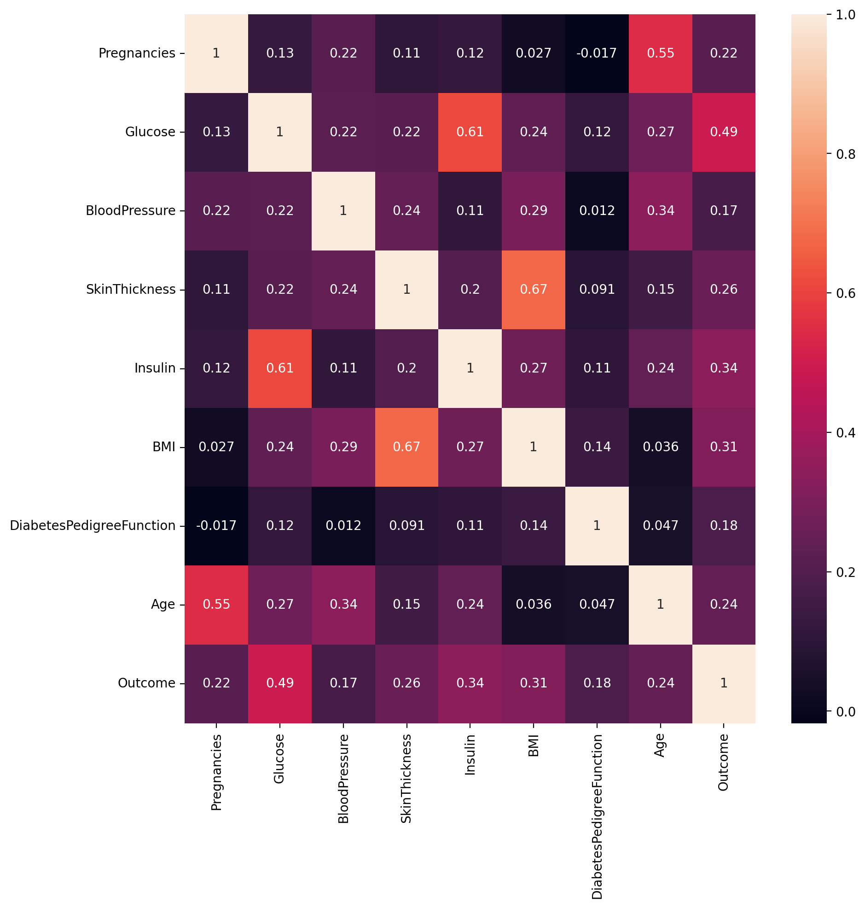
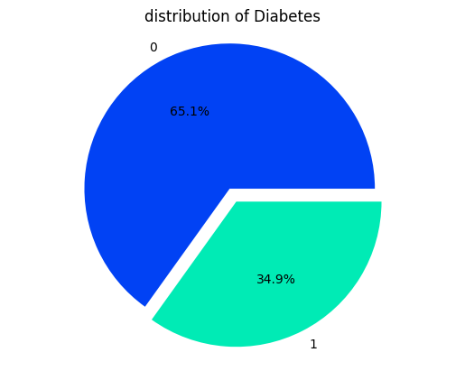
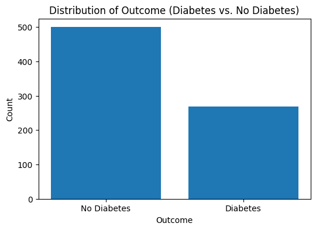
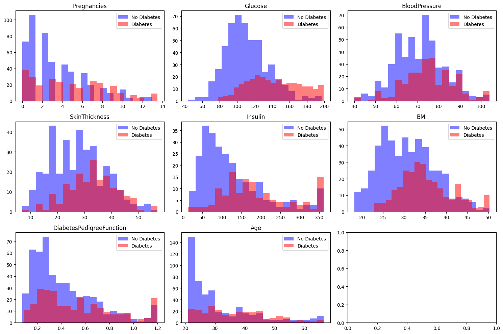
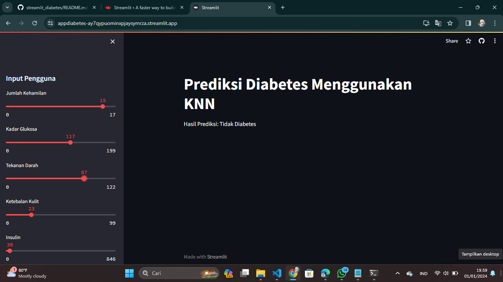

## Laporan Proyek Machine Learning

## Nama : Nur Rahma Diah
## NIM : 211351107
## Kelas : Malam A

## Domain Proyek
Proyek ini berfokus pada domain kesehatan, dengan tujuan menganalisis dan memprediksi kemungkinan terjadinya diabetes pada populasi Pima Indians. Analisis ini dapat memberikan wawasan tentang faktor-faktor yang mempengaruhi diabetes pada kelompok ini dan membantu dalam upaya pencegahan serta manajemen penyakit.

## Business Understanding
Memprediksi risiko diabetes untuk mendukung upaya pencegahan dan pengelolaan kesehatan. Analisis ini dapat digunakan oleh penyedia layanan kesehatan atau peneliti untuk mengidentifikasi individu yang berpotensi mengidap diabetes.

## Problem Statement
Membuat model prediktif untuk mengidentifikasi individu yang berisiko mengidap diabetes. Memberikan alat yang berguna untuk penyedia layanan kesehatan dalam upaya pencegahan dan manajemen diabetes.

## Goals
Mencapai tingkat akurasi tertentu dalam memprediksi kejadian diabetes. Mengembangkan model yang dapat memberikan hasil prediksi yang dapat diandalkan.

## Solutions Statement
Menggunakan metode K-Nearest Neighbors (KNN) untuk memodelkan hubungan antara atribut kesehatan dan kejadian diabetes.

## Data Understanding
- *Sumber Data:* Dataset Pima Indians Diabetes Database dari [Kaggle](https://www.kaggle.com/datasets/uciml/pima-indians-diabetes-database?resource=download)
- *Struktur Data:* Mengeksplorasi struktur dataset, melihat jumlah baris dan kolom.
- *Tipe Data:* Meninjau tipe data dari setiap kolom menggunakan df.dtypes.

## Variabel yang Digunakan
- *Variabel Dependan (Target):* "Outcome" yang menunjukkan apakah seseorang memiliki diabetes atau tidak.
- *Variabel Independen (Fitur):* Atribut kesehatan seperti glukosa darah, tekanan darah, BMI, dll.

## Data Preparation
### Data Collection:
Menggunakan dataset Breast Cancer Wisconsin dari [kaggle](https://www.kaggle.com/datasets/uciml/pima-indians-diabetes-database?resource=download)

### Import Dataset:
Ambil dataset dari Kaggle (pastikan Anda sudah mengatur API Kaggle Anda).
Ganti username dan key dengan informasi API Kaggle Anda
Kaggle API dapat diatur di halaman profil [kaggle](https://www.kaggle.com/account) anda.

Setelah mengunduh file kaggle.json dari halaman profil Kaggle, upload file tersebut ke penyimpanan tempat Anda menjalankan kode ini.
```
from google.colab import files
files.upload()
```

Pindahkan file kaggle.json ke direktori yang benar
```
!mkdir -p ~/.kaggle
!cp kaggle.json ~/.kaggle/
!chmod 600 ~/.kaggle/kaggle.json
!ls ~/.kaggle
```

Unduh dataset dari Kaggle
```
!kaggle datasets download -d uciml/breast-cancer-wisconsin-data
```

Ekstrak file zip
```
!unzip breast-cancer-wisconsin-data.zip -d breast-cancer-wisconsin-data
!ls breast-cancer-wisconsin-data
```

### Import Library
Import semua library yang dibutuhkan,
```
import pandas as pd
import numpy as np
import matplotlib.pyplot as plt
import sklearn.metrics as metrics
import seaborn as sns

from sklearn.model_selection import train_test_split
from sklearn.preprocessing import StandardScaler,LabelEncoder
from sklearn import preprocessing 
from sklearn.linear_model import LogisticRegression
from sklearn.metrics import accuracy_score,classification_report
from sklearn.metrics import confusion_matrix,ConfusionMatrixDisplay
from sklearn.neighbors import KNeighborsClassifier

import pickle
import warnings
warnings.filterwarnings("ignore")
```
### Data Discovery
load data, baca dataset ke dalam DataFrame Pandas
```
df = pd.read_csv('pima-indians-diabetes-database/diabetes.csv')
```

```
df.head()
df.shape
df.info()
df.describe()
```

selanjutnya kita akan memeriksa apakah datasetsnya terdapat baris yang kosong atau null
```
df.isnull().sum()
```

### Data Discovery (EDA)
```
df.hist(figsize=(16, 20), bins=40, xlabelsize=6, ylabelsize=6);
```


```
plt.figure(figsize=(10,10),dpi=200)
sns.heatmap(df.corr(),annot=True)
```


```
Diabetes_column = df.Outcome.value_counts()

# pie chart for target column
plt.pie(Diabetes_column, labels = Diabetes_column.index, autopct="%1.1f%%", explode = [0,0.1], colors = ["#0142F4","#00EBB5"])
plt.title("distribution of Diabetes")
plt.axis("equal")
plt.show()
```


```
# Count the occurrences of each outcome (0: No diabetes, 1: Diabetes)
outcome_counts = df['Outcome'].value_counts()

# Create a bar plot
plt.figure(figsize=(6, 4))
plt.bar(outcome_counts.index, outcome_counts.values, tick_label=['No Diabetes', 'Diabetes'])
plt.xlabel('Outcome')
plt.ylabel('Count')
plt.title('Distribution of Outcome (Diabetes vs. No Diabetes)')

# Show the plot
plt.show()
```


```
# Create subplots
fig, axes = plt.subplots(nrows=3, ncols=3, figsize=(15, 10))

# Flatten the axes array for easier iteration
axes = axes.flatten()

# Features to plot (excluding 'Outcome' which is the target variable)
features = df.columns[:-1]

# Plot histograms for each feature
for i, feature in enumerate(features):
    ax = axes[i]
    ax.hist(df[df['Outcome'] == 0][feature], alpha=0.5, label='No Diabetes', color='blue', bins=20)
    ax.hist(df[df['Outcome'] == 1][feature], alpha=0.5, label='Diabetes', color='red', bins=20)
    ax.set_title(feature)
    ax.legend()

# Adjust layout and display
plt.tight_layout()
plt.show()
```



### Data Preprocessing
```
# Extract the features (X) and target variable (y)
X = df.drop('Outcome', axis=1)
y = df['Outcome']
```

```
# Split the data into training and testing sets
X_train, X_test, y_train, y_test = train_test_split(X, y, test_size=0.2, random_state=42)
```

```
# Standardize the features
sc = StandardScaler()
X_train = sc.fit_transform(X_train)
X_test = sc.transform(X_test)
```

```
X = df.drop(columns = 'Outcome')
target = df['Outcome']

X_train , X_test , y_train , y_test = train_test_split(X ,target ,test_size=0.2 , random_state=42 )
print("X_train shape:", X_train.shape)
print("y_train shape:", y_train.shape)
print("X_test shape:", X_test.shape)
print("y_test shape:", y_test.shape)
```
X_train shape: (614, 8)

y_train shape: (614,)

X_test shape: (154, 8)

y_test shape: (154,)

```
missing_values = ["Glucose", "BloodPressure", "SkinThickness", "Insulin", "BMI"]
df[missing_values] = np.where(df[missing_values] == 0, np.nan, df[missing_values])
```

### Data Modelling
```
def train(classifier,x_train,y_train,x_test,y_test):

    classifier.fit(x_train,y_train)
    prediction = classifier.predict(x_test)
    cv = RepeatedStratifiedKFold(n_splits = 10,n_repeats = 3,random_state = 42)
    print("Cross Validation Score : ",'{0:.2%}'.format(cross_val_score(classifier,x_train,y_train,cv = cv,scoring = 'roc_auc').mean()))


def model_evaluation(classifier,x_test,y_test):

    # Confusion Matrix
    cm = confusion_matrix(y_test,classifier.predict(x_test))
    names = ['True Neg','False Pos','False Neg','True Pos']
    counts = [value for value in cm.flatten()]
    percentages = ['{0:.2%}'.format(value) for value in cm.flatten()/np.sum(cm)]
    labels = [f'{v1}\n{v2}\n{v3}' for v1, v2, v3 in zip(names,counts,percentages)]
    labels = np.asarray(labels).reshape(2,2)
    sns.heatmap(cm,annot = labels,cmap = 'Greens',fmt ='')

    # Classification Report
    print(classification_report(y_test,classifier.predict(x_test)))
```

### Evaluation dari Dataset
```
from sklearn.metrics import accuracy_score, precision_score, recall_score, f1_score, roc_auc_score, roc_curve

Make a dictionary consist of model names and metrics
model_evaluation = {'Models' : [],
                    'Accuracy' : [],
                    'Precision' : [],
                    'Recall' : [],
                    'F1_score' : []
                   }

Make a list of models and y_pred into predictions list
models = ['KNN']
predictions = [knn_predict]

Iterate the model evaluation
for model_name, y_pred in zip(models, predictions):
    accuracy = accuracy_score(y_test, y_pred)
    precision = precision_score(y_test, y_pred)
    recall = recall_score(y_test, y_pred)
    f1 = f1_score(y_test, y_pred)

Insert scores into the 'model_evaluation' dictionary
    model_evaluation['Models'].append(model_name)
    model_evaluation['Accuracy'].append(accuracy)
    model_evaluation['Precision'].append(precision)
    model_evaluation['Recall'].append(recall)
    model_evaluation['F1_score'].append(f1)

Convert dictionary into a DataFrame
metrics_table = pd.DataFrame(model_evaluation)
metrics_table.set_index('Models', inplace=True)
metrics_table
```
## Deployment

Pastikan untuk menyesuaikan langkah-langkah ini dengan kebutuhan proyek Anda dan secara kontinu melakukan iterasi untuk meningkatkan model dan hasil prediksi.
[My Prediction App](https://appdiabetes-ay7qypuominxpjaysymrza.streamlit.app/)

